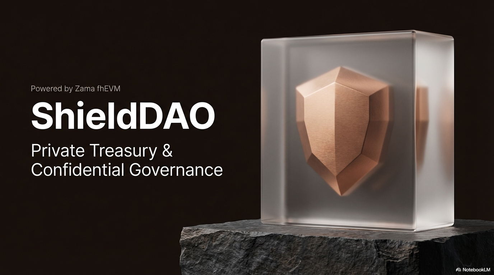
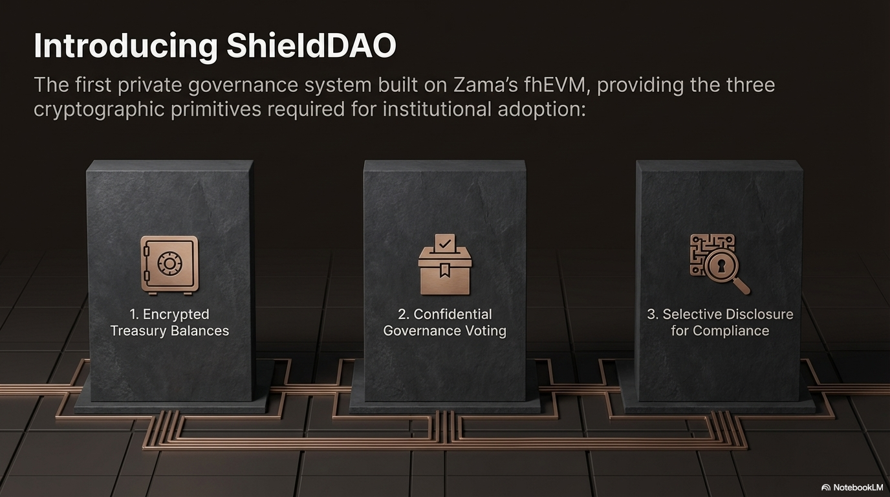
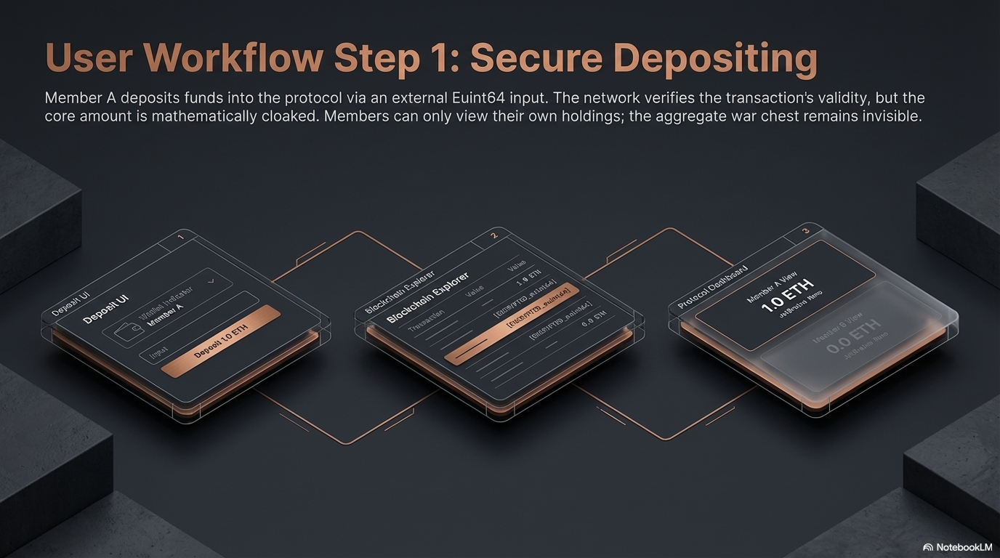
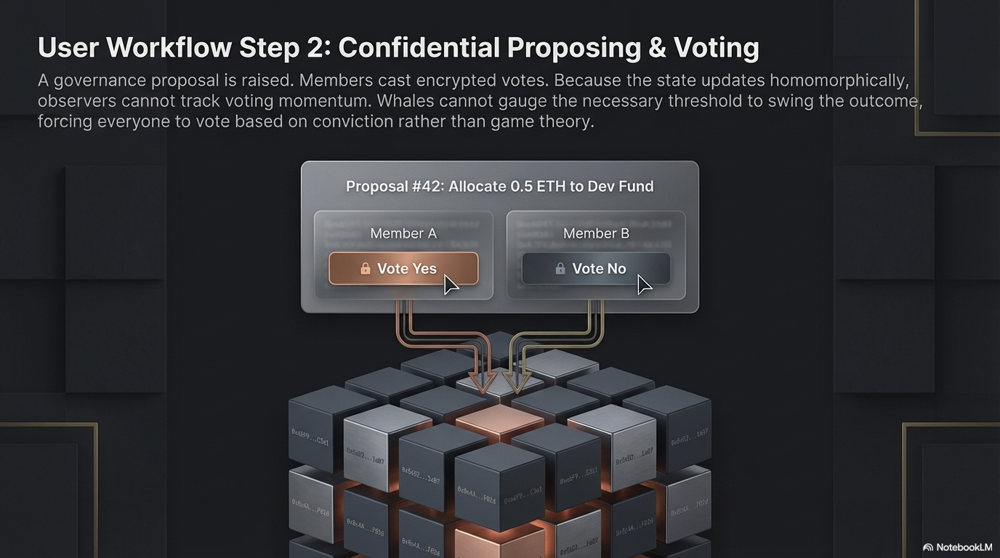
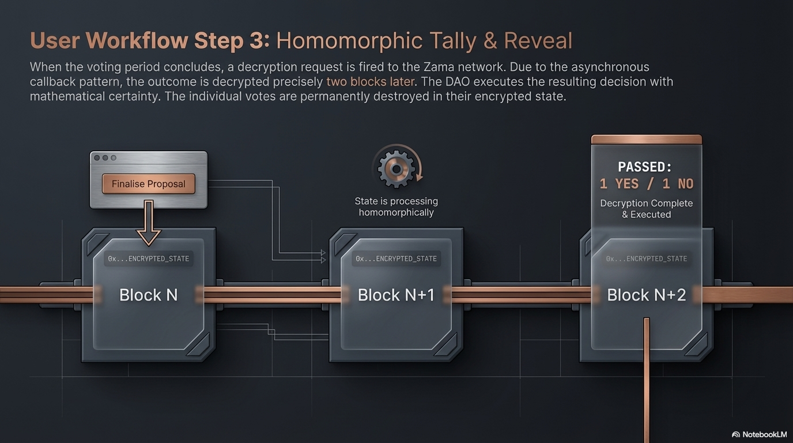
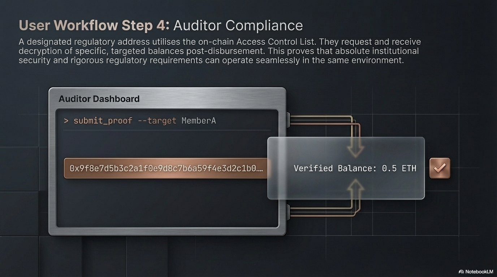
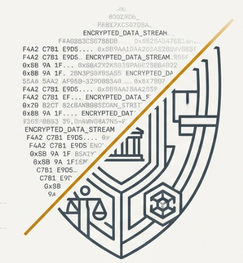

# ShieldDAO 🛡️

**Confidential Governance & Treasury Management powered by Fully Homomorphic Encryption (FHE)**

[](https://sepolia.etherscan.io/)
[](https://zama.ai/)
[](https://opensource.org/licenses/MIT)

---

<p align="center">
  
</p>

## 🌌 The Vision

Traditional DAOs operate in a "glass house"—every balance, vote, and transaction is exposed to the public. For institutional DAOs, private wealth management, or sensitive governance, this transparency is a barrier.

**ShieldDAO** smashes this barrier using **Fully Homomorphic Encryption (FHE)**. We enable "Blind Computation"—allowing smart contracts to process data while it remains encrypted. 

> **ShieldDAO is the privacy layer the DAO ecosystem has been waiting for.**

---

## 🔥 Key Features

### 🔐 1. Confidential Treasury
Manage your assets in total secrecy. Member balances are stored as encrypted ciphertexts. Neither the admin nor other members can see your holdings.
<p align="center">
  
  
</p>

### 🗳️ 2. Homomorphic Voting
Cast your vote without revealing your choice. ShieldsDAO tallies votes using FHE arithmetic, ensuring the final result is correct without ever decrypting individual ballots.

### 🔍 3. Selective Disclosure (Audit-Ready)
Compliance doesn't mean sacrificing privacy. ShieldDAO allows members to grant temporary decryption rights to designated auditors for regulatory reporting.

---

## ⚙️ How it Works: The FHE Lifecycle

ShieldDAO leverages the **Zama fhEVM** to maintain a "Shielded State" throughout the entire transaction lifecycle.

<p align="center">
  
  
  
  
</p>

1.  **Local Encryption**: Data is encrypted on the user's device using public keys.
2.  **Blind Computation**: Smart contracts perform operations directly on ciphertexts.
3.  **On-Chain Commitment**: Encrypted results are finalized on the Zama fhEVM.
4.  **Authorized Disclosure**: Selective decryption for authorized auditors only.

---

## 🛠️ Technical Stack

- **Smart Contracts**: Solidity ^0.8.24 (fhEVM compatible)
- **Encryption Engine**: [Zama fhEVM](https://github.com/zama-ai/fhevm)
- **Frontend**: Next.js 14, TypeScript, Tailwind CSS
- **Experience**: Framer Motion, GSAP (Cyber-Terminal Aesthetic)
- **Development**: Hardhat, Ethers.js
- **Network**: Sepolia (FHE Testnet)

---

## 🚢 Admission & Operator Terminals

ShieldDAO features a dual-interface terminal system designed for maximum immersion and utility:

| **Admission Terminal** | **Operator Terminal** |
| :--- | :--- |
| **Onboarding**: Secure guest enrollment and identity verification. | **Management**: Advanced DAO administration and treasury controls. |
| **UX**: Minimalist, high-fidelity entry-point. | **UX**: Complex data visualization and operator logs. |

---

## 🚀 Getting Started

### Installation

```bash
# Clone the vault
git clone https://github.com/karanmax999/ShieldDao.git
cd ShieldDao

# Install core dependencies
npm install

# Setup the frontend
cd frontend
npm install
```

### Quick Start (Dev Mode)

```bash
# Start the local frontend
npm run dev
```

---

## 🗺️ Future Roadmap

- [ ] **Multi-Token Support**: Support for confidential ERC-20 and NFT assets.
- [ ] **Advanced Governance**: Quadratic voting and weighted delegation with FHE.
- [ ] **ShieldSDK**: A toolkit for other DAOs to integrate ShieldDAO's privacy features.

---

<p align="center">
  
  <br>
  <i>Built with ❤️ for the Zama FHE Hackathon</i>
</p>
